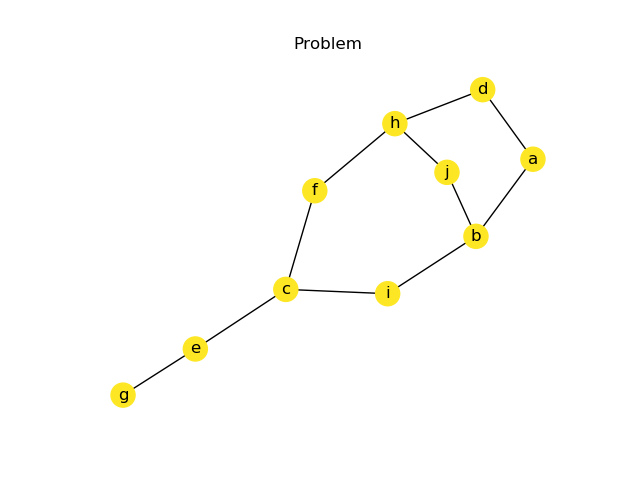

## The Bivariate Marginal Distribution ALgorithm

--- 

This repository implements a Python code for the paper 

> Pelikan, Martin, and Heinz Mühlenbein. "The bivariate marginal distribution algorithm." Advances in Soft Computing. Springer, London, 1999. 521-535.

As a educational code, its implementation is not aimed at high-end performance applications. Instead, legibility in the 
was kept as clear as possible. 

Feel free to use this code as you seem more appropriate, citing the authors:

```
@incollection{pelikan1999bivariate,
  title={The bivariate marginal distribution algorithm},
  author={Pelikan, Martin and M{\"u}hlenbein, Heinz},
  booktitle={Advances in Soft Computing},
  pages={521--535},
  year={1999},
  publisher={Springer}
}
```

and adding a foot note to this repository =)

### Usage

This code has two examples: the graph coloring problem and the worldmap coloring problem.
Both problems try to minimize conflicts among nodes/countries (that is, two neighboring nodes/countries must not have the same color).

Evidently, quality of solutions is directly affected by the palette size.

**Output of worldmap problem:**


**Output of graph coloring problem:**



Problem


Relationship between variables found by BMDA


Best individual
 
 